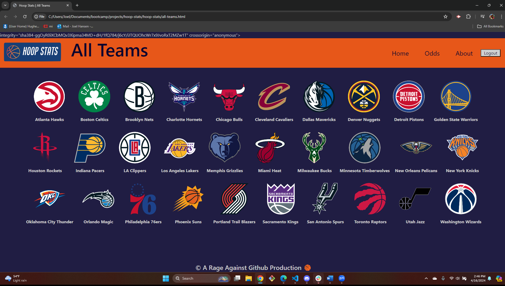

# Hoop Stats

## Description
 -Welcome to Hoop Stats!  This application was designed with NBA basketball fan in mind and serves as one-stop-shop where you can get all your NBA information in one place.  Users create a profile with a unique username and password and select their favorite teams to be saved to their profile.  Users can also use the odds page to compare two or more teams together to see which one is more likely to win based on their overall win percentage.  Users are also able to click team logos on the ‘All-Teams’ page to access all the latest news, and statistics for that team through the ESPN website.  

-Hoop Stats was created by a group of four bootcamp students (Vanessa Bou, Kyle Butcher, Ozge Ahunbay, and Joel Hansen) at the University of Minnesota.  This page incorporates elements of Bootstrap, Jquery, and uses the ESPN open API to access information provided in the application.  

-Thanks for visiting Hoop Stats! We hope that you enjoy it as much as we enjoyed building it!

## Authors

Ozge Ahunbay

Vanessa Bou

Kyle Butcher

Joel Hansen

## Badges and Acknowledgements

## Usage

![Login page with key areas highlighted]

![Homepage with key areas highlighted]

![Odds page with key areas highlighted]

## Screenshot

![Gif of Odds page]

![Screenshot of About Us page]

## Deployed Application

[Click here](https://rvbouu.github.io/hoop-stats/) to view the deployed version.