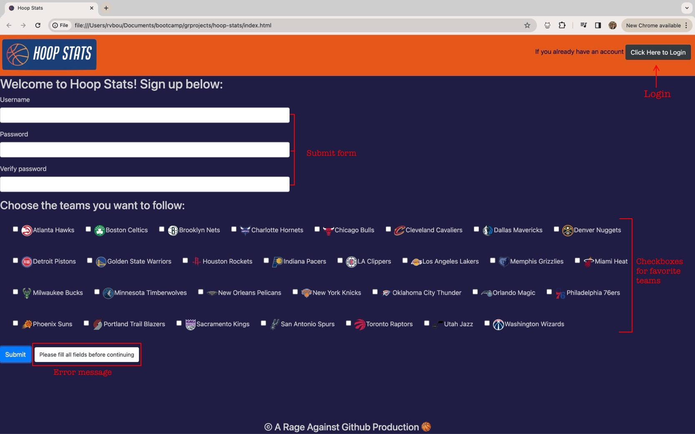
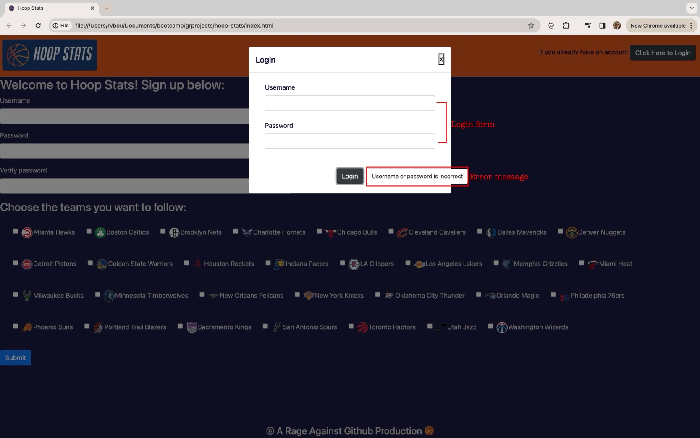
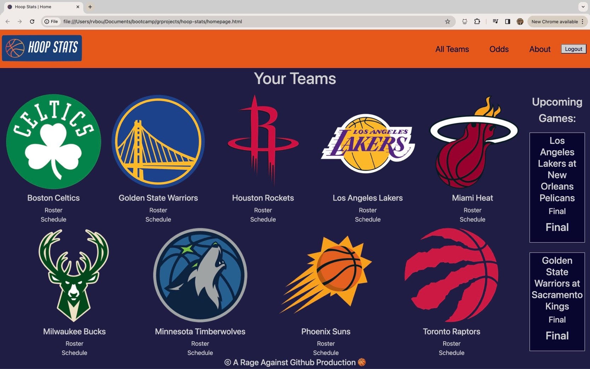
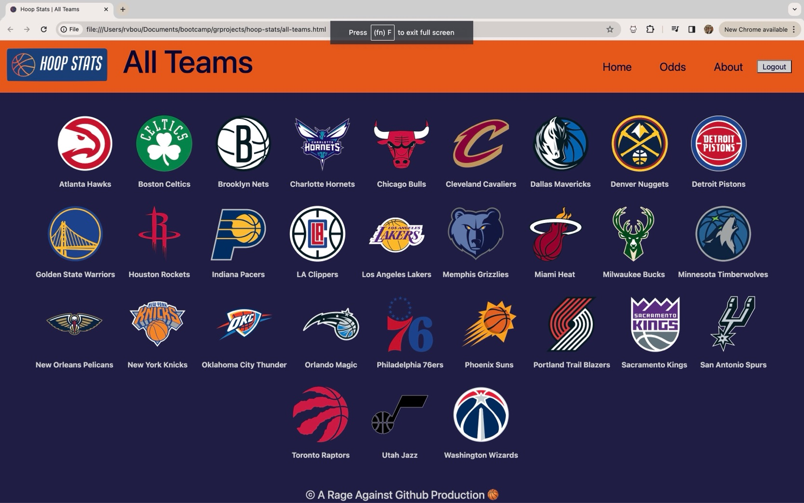
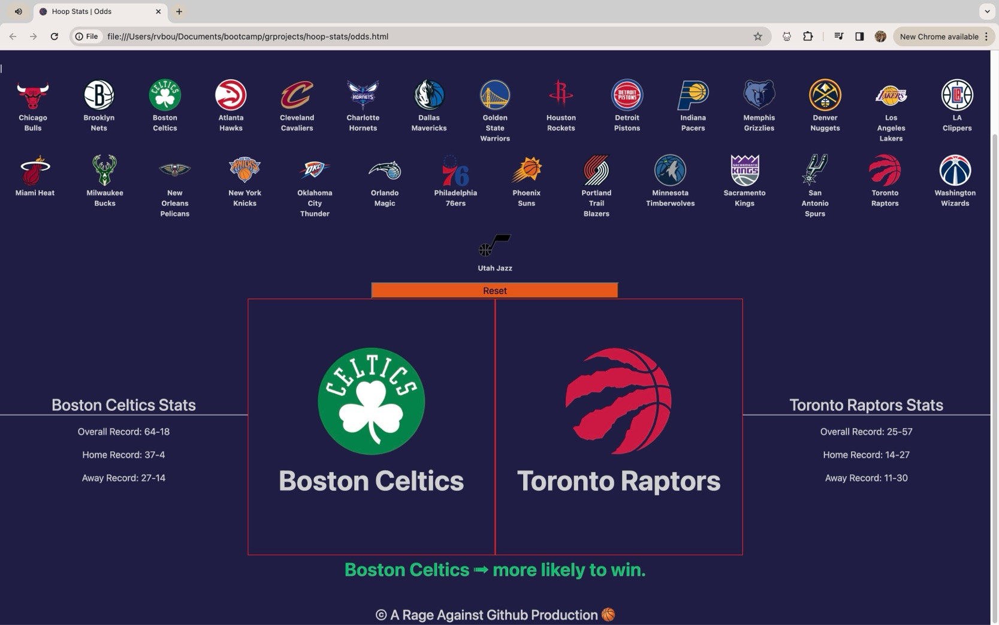
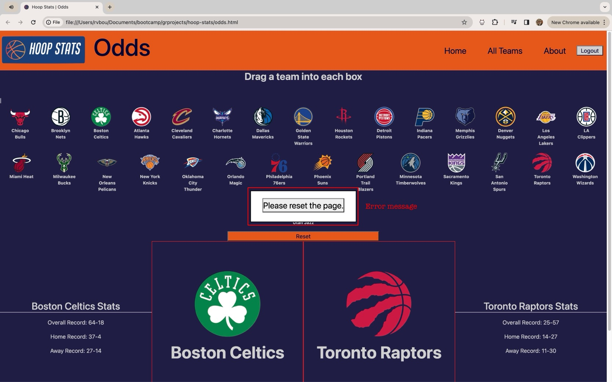

# Hoop Stats

## Description

 Welcome to Hoop Stats!  This application was designed with NBA basketball fan in mind and serves as one-stop-shop where you can get all your NBA information in one place.  Users create a profile with a unique username and password and select their favorite teams to be saved to their profile.  Users can also use the odds page to compare two or more teams together to see which one is more likely to win based on their overall win percentage.  Users are also able to click team logos on the ‘All-Teams’ page to access all the latest news, and statistics for that team through the ESPN website.  

Hoop Stats was created by a group of four bootcamp students (Vanessa Bou, Kyle Butcher, Ozge Ahunbay, and Joel Hansen) at the University of Minnesota.  This page incorporates elements of Bootstrap, Jquery, and uses the ESPN open API to access information provided in the application.  

Thanks for visiting Hoop Stats! We hope that you enjoy it as much as we enjoyed building it!

## Authors

Ozge Ahunbay

Vanessa Bou

Kyle Butcher

Joel Hansen

## Badges and Acknowledgements

Thank you to our instructor Gary and TA Katy for assisting us when needed during this project!

## Usage

When users first enter the site, they are presented with a submit form where they'll enter a username, password and verify the password. They are also given the option to select NBA teams they'd like to follow. If the form is left empty and is submitted, the user will be presented with an error message.

If the user has already made an account, they can login using the "Click Here to Login" button in the top right corner.

If the user is logging in, they are presented with a pop-up form where they'll enter their username and password. If the user is not found in the database(localStorage) or their username/password is incorrect, an error message will appear.

Once the user creates an account or logs in, they will be redirected to their homepage. This page will have the teams they selected to follow displayed upfront with links to the team's website (team logo), roster, and schedule. They will also see upcoming/current games in the side bar. If the user accesses their account during a game, the game card will display the current quarter and time left in that quarter.

The user will also have the option to navigate to the All Teams, Odds, and About page as well as logout.

On the All Teams page, the user will see all current teams in the NBA league. They will also be able to click on the team's logo to be redirect to that team's page.

On the Odds page, users will have the opportunity to compare two teams to see who is most likely to win. Users can drag a team to each box and will be presented with the teams' stats as the most likely winner between the two. There is also a reset button so the user can continue to compare all the different team combinations they'd like to.

If users try to drag another team into the compare boxes before resetting the page, an error message will appear, prompting the user to reset the page. If the error message is clicked, the page will reset.

## Screenshot

## Deployed Application

[Click here](https://rvbouu.github.io/hoop-stats/) to view the deployed version.